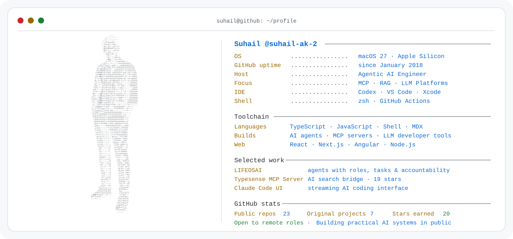

  <picture>
    <source media="(prefers-color-scheme: dark) and (max-width: 640px)" srcset="./assets/profile-terminal-mobile.svg" />
    <source media="(prefers-color-scheme: dark)" srcset="./assets/profile-terminal.svg" />
    <source media="(max-width: 640px)" srcset="./assets/profile-terminal-mobile-light.svg" />
    
  </picture>

